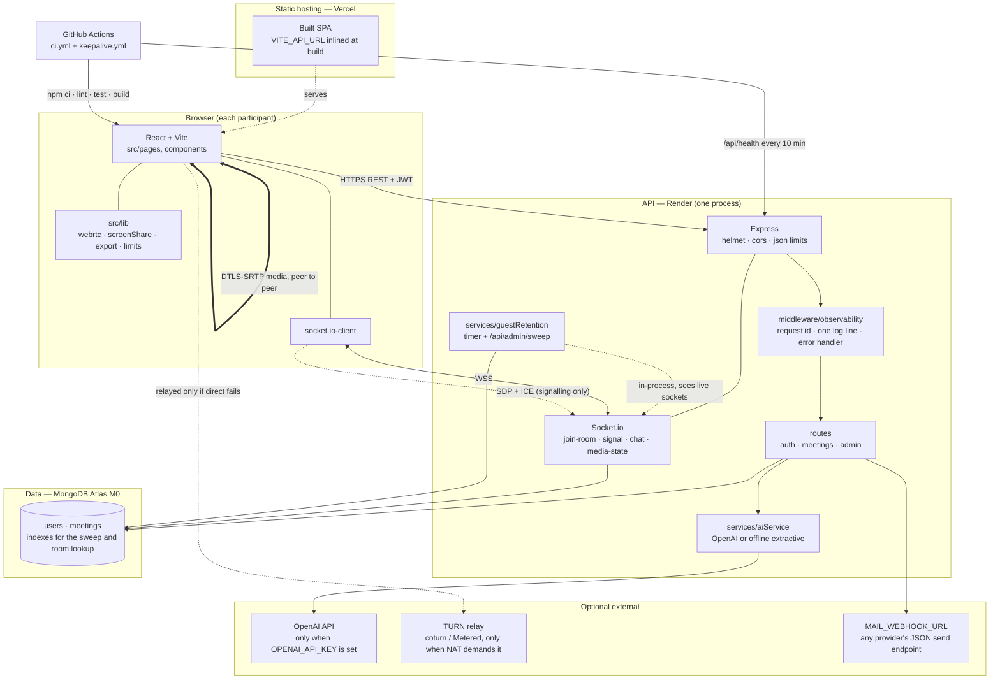

# Architecture

IntelliMeet is three processes and one external service: a React client, an
Express + Socket.io API, a MongoDB database, and (optionally) an AI provider. The
one structural decision worth reading the rest of this document for is that
**media never touches the server**. Calls are a WebRTC mesh — each browser sends
its audio and video straight to each other browser — so the server's job is
signalling, chat, and data. That is what makes a single free-tier instance able
to carry a real two-person call, and it is also the limit: mesh grows as
`O(n²)` connections, which is why rooms are groomed for 2–6 peers and an SFU is
the documented next step rather than a claim.

## Deploy topology



The thick line between the two browsers is the whole point: audio and video take
that path, and the API is not on it. If the direct path fails (strict or
symmetric NAT), the TURN relay carries it instead — and the room shows an amber
**via TURN** badge so you can tell which happened.

## The same topology as ASCII

The report PDF is generated from Markdown by a small in-repo renderer that draws
no images, so the diagram is repeated here in a form that survives that: the
brief's own documentation guidelines allow clean ASCII art where no drawing tool
was used.

```
                          +---------------------------+
                          |   Browser (participant)   |
                          |                           |
                          |  React SPA  ---- src/lib  |
                          |      |            |       |
                          |  socket.io   WebRTC stack |
                          +------+------------+-------+
                                 |            |
               WSS signalling     |            |   DTLS-SRTP media
        (SDP, ICE, chat,          |            |   (audio + video,
         presence, state)         |            |    peer to peer)
                                 v            |            |
        +--------------------------------+    |            |
        |  API  --  Render, one process  |    |            |
        |                                |    |            |
        |  Express ---- middleware ----- |    |            |
        |    helmet / cors / json limits |    |            |
        |    observability (req id, log) |    |            |
        |      |                         |    |            |
        |      +-- routes: auth          |    |            |
        |      |           meetings      |    |            |
        |      |           admin         |    |            |
        |      +-- Socket.io: join-room  |    |            |
        |      |   signal  chat-message  |    |            |
        |      |   media-state           |    |            |
        |      +-- aiService -> OpenAI   |    |            |
        |      +-- guestRetention timer  |    |            |
        +---------------+----------------+    |            |
                        |                     |            |
                        v                     |            |
        +--------------------------------+    |            |
        |  MongoDB Atlas M0              |    |            |
        |   users · meetings             |    |            |
        |   + indexes for room lookup,   |    |            |
        |     guest sweep, verification  |    |            |
        +--------------------------------+    |            |
                                              |            |
                    +----------------------+  |            |
                    | TURN relay (coturn)  |<-+------------+
                    | used ONLY when the   |               |
                    | direct path fails    |               |
                    +----------------------+               |
                                                           |
        +--------------------------------+                 |
        |  GitHub Actions                |                 |
        |   ci.yml  lint/test/build      |   Vercel serves |
        |   keepalive.yml /api/health    |   the built SPA |
        +--------------------------------+   VITE_API_URL  |
                                                           v
```

## Runtime flows

**A first visit, with no account.** The client loads from the static host, reads
the inlined `VITE_API_URL`, and `POST /api/auth/demo`. The server creates a real
`User` flagged `isGuest` whose password hash is of a random value that is never
stored — nobody can log into it — plus a room of its own, seeded with a sample
meeting so chat, summary and action items show real content on arrival. The
response carries a JWT, so this visitor is an ordinary authenticated member from
here on. Guests are swept by age (below) rather than shared, so two people who
click the button never collide.

**An invited visitor.** Opening `/room/<code>` without a session creates a guest
*in that room* instead of provisioning a new one, which is what makes **Copy
invite link** work across devices and networks. Invited guests join as
participants, never as host.

**A call.** Both clients connect the socket, emit `join-room`, and the server
tells the room who is present. The newcomer repeats its own `media-state` so
everyone else's tiles are labelled correctly on the first paint. The peers then
exchange SDP offers/answers and ICE candidates over the `signal` event — the
server relays that payload without inspecting it (it is codec-agnostic and
length-capped, not parsed), and the actual media flows directly between the
browsers. Screen sharing reuses the same connection: `getDisplayMedia` produces a
track that is swapped into the outgoing stream with `replaceTrack`, so there is
no renegotiation and no second stream.

**Chat.** `chat-message` is validated (non-empty, length-capped, rate-capped per
user), persisted on the meeting, and broadcast to the room. Persisting it is
what makes the transcript — and therefore the summary — possible without a
separate transcription service.

**A summary.** `POST /api/meetings/:id/summarize` takes a pasted transcript, or
falls back to building one from the chat log, and produces a summary plus action
items. With `OPENAI_API_KEY` set it calls OpenAI; without one it uses a free,
offline extractive summarizer, so the AI feature is real and demoable with zero
API cost and no account. Action items are stored on the meeting and ticked by
anyone in the room via `PATCH /api/meetings/:id/action-items/:index`, which
broadcasts `action-item-updated` so a tick is live rather than a refresh away.

**The sweep.** Every guest is a stored user and a stored room, so a timer
deletes guests older than `GUEST_RETENTION_HOURS` together with the rooms they
own. It deliberately runs *inside* the API process: deciding whether a demo is
still going needs Socket.io's live membership, and a separate cron process would
happily delete a room someone is sitting in. `POST /api/admin/sweep` (behind
`x-admin-token`) exists so an external scheduler can trigger that same in-process
sweep, and `DEMO_MAX_GUEST_ROOMS` bounds the collection even if the sweep stops
running at all.

## Socket surface

Signalling only — no media — plus the room's shared state.

| Event | Direction | Carries | Who gets it |
|---|---|---|---|
| `join-room` | client → server | `{ roomCode, token }` | room becomes aware; everyone re-announces `media-state` |
| `leave-room` | client → server | — | room |
| `signal` | client → server | `{ to, data }` (opaque SDP/ICE, ≤ 20,000 chars) | relayed to `to` only |
| `chat-message` | client → server | `{ roomCode, text }` | persisted, then broadcast to the room |
| `media-state` | client → server | `{ micOn, camOn, sharing }` | room, so tiles can be labelled |
| `signal` | server → client | relayed payload | the addressed peer |
| `chat-message` | server → client | the persisted message | the room |
| `media-state` | server → client | validated state | the room |
| `action-item-updated` | server → client | the whole action-item list | the room |
| `removed-from-room` | server → client | — | the evicted socket, which then stops retrying |
| `error-message` | server → client | the reason | the sender |

Every payload is validated rather than trusted: a `join-room` with no argument
used to throw inside an async listener and tell the client nothing, so the
handlers now guard their inputs, cap lengths, and answer `error-message` instead.

## REST surface

| Route | Auth | Purpose |
|---|---|---|
| `GET /api/health` | — | heartbeat; also what the keep-alive ping hits |
| `POST /api/auth/signup` · `/login` · `/demo` | rate-limited | session issuing; `/demo` provisions the guest |
| `POST /api/auth/claim` | JWT | turn the current guest into a real account |
| `POST /api/auth/verify-email` · `/resend-verification` | rate-limited | spend or reissue the one-time link |
| `POST /api/meetings` | JWT | create a room (rate-limited) |
| `GET /api/meetings` | JWT | the caller's history, for the dashboard |
| `GET /api/meetings/room/:roomCode` | JWT | resolve an invite link |
| `GET /api/meetings/:id` | member | one meeting with chat, summary, action items |
| `POST /api/meetings/:id/summarize` | member | summary + action items (per-user limit) |
| `PATCH /api/meetings/:id/action-items/:index` | member | tick or untick an item, broadcast to the room |
| `POST /api/meetings/:id/end` | host | end the meeting |
| `DELETE /api/meetings/:id/participants/:userId` | host | remove, or `?ban=true` to remove and ban |
| `GET /api/admin/stats` · `POST /api/admin/sweep` | `x-admin-token` | operator view and manual sweep; both `404` while unset |

## Data model

`User`: `name`, `email` (unique, the login key), `passwordHash`, `isGuest`,
`emailVerified`, and an optional `emailVerification` sub-document holding only a
*token hash*, so a database leak yields no working links. Indexes:
`{ isGuest, createdAt }` for the sweep, and a sparse index on
`emailVerification.tokenHash` because verifying a public link must not be a
collection scan.

`Meeting`: `title`, `roomCode` (unique), `host`, `participants`, `banned`,
`startedAt`, `endedAt`, `status`, `chatMessages[]`, `transcript`, `summary`,
`actionItems[]`. `banned` lives on the document rather than in memory, so a
reload, a new tab or a server restart cannot walk a kicked user back in.
Indexes on `host`, `participants` and `banned` exist because the guest sweep
looks a deleted guest up in all three.

## Trust boundaries

- **The server is the authority for every write.** The client mirrors two
  user-facing caps so the UI can stop a user early, but the caps that matter live
  in one place (`server/src/config/limits.js`) and are enforced server-side.
- **Authorization is per route, not per origin.** CORS is the browser's rule and
  stops a page from *reading* a response, not a script from calling the API, so
  every route authorizes on its own: JWT, plus host-or-participant membership.
  A `*` origin is stripped rather than honoured — a browser refuses a wildcard on
  a credentialed request, so honouring it would silently allow nothing — and the
  mistake is reported at boot.
- **Media is outside the server's trust boundary.** The server never sees or
  stores audio/video, and cannot inspect a call; that also means it cannot
  moderate one beyond removing a participant, which Host controls do.
- **Secrets never reach the response.** Stacks go to the log and a request id
  goes to the client, credentials-shaped log fields are redacted on the way in,
  and a mail link is never logged in production, where it would be a working
  credential.

## What is deliberately not here

| Not built | Why | What it would take |
|---|---|---|
| SFU media server | mesh is enough for a 2–6 peer demo; SFU is a different product | LiveKit/mediasoup, a media service, and a second deploy |
| Redis adapter + sticky sessions | the in-process `io` reference is how moderation evicts a socket; that does not cross instances | Redis, a socket.io adapter, and sticky routing before any multi-instance deploy |
| Horizontal scaling | single process is honest at demo scale, and the plan says so instead of claiming otherwise | the row above, then a load test |
| Live transcription | Whisper needs a paid key or a GPU, which the brief forbids for a judge's clone | the browser's Web Speech API is the free path — planned, flagged, optional |
